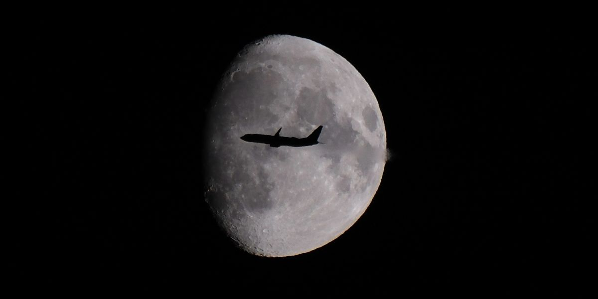
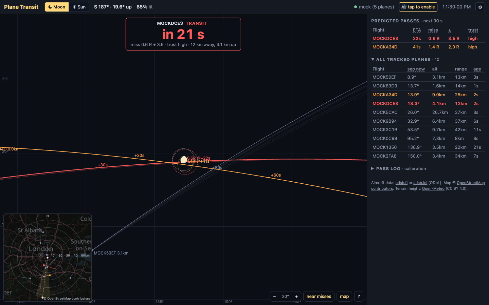

# Plane Transit



**Predicts which planes are about to pass in front of the moon or the sun, as seen from
where you stand — so you can photograph the transit.**

A plane crossing the moon or the sun is over in a fraction of a second, and from a
few metres to one side it misses altogether. Plane Transit watches live aircraft
positions (ADS-B) around you and shows a sky view centred on the moon or the sun:
every nearby plane, its track predicted up to 90 s ahead with an honest uncertainty,
and a timetable of the close approaches coming up. When a plane is lined up, a sound
countdown tells you when to shoot, so your eye can stay on the viewfinder.

It runs as a small web app on your computer or a Raspberry Pi at home, and works on
your phone in the field.

> **☀ Sun mode is only safe behind a solar filter.** Never look at the sun through a
> viewfinder, lens, or unfiltered camera — it causes permanent eye damage in seconds
> and will destroy a sensor. Use a certified full-aperture filter mounted on the
> **front** of the lens, inspect it for pinholes, and make sure it cannot be knocked
> off while you are tracking a plane. The app shows this warning whenever sun mode is
> selected.



## Quick start

Clone this repository, then:

```
node serve.js
```

Open http://localhost:8321. No dependencies, no build step, Node 14 or newer. The
first run asks where you are standing; nothing is predicted until it knows.

To see it work without waiting for a real transit, pick **mock (demo planes)** under
⚙ → Advanced → data source: fake planes are aimed at the moon or the sun, whichever is
up, so you can watch the countdown and the sound cue.

The local server is required: it serves the page and proxies the ADS-B APIs, which
don't allow direct browser requests.

### Configuration

All optional, as environment variables for `serve.js`:

| variable | default | |
|---|---|---|
| `PLANE_TRANSIT_PORT` | `8321` | http port |
| `PLANE_TRANSIT_BIND` | `0.0.0.0` | listen address; `127.0.0.1` keeps it to this machine |
| `PLANE_TRANSIT_LOCAL_URL` | — | a local ADS-B receiver's `aircraft.json` to merge in (below) |
| `PLANE_TRANSIT_TLS_DIR` | — | folder with `server.crt` + `server.key`; turns on https |
| `PLANE_TRANSIT_TLS_PORT` | `8443` | https port |

### Keep it on your own network

`serve.js` listens on every interface so a phone on the same wifi can use it. It has
no login and proxies aircraft requests on your behalf, so **don't expose it to the
internet** (no port forwarding). Upstream requests are capped at 10 per 10 s in total
— adsb.fi's own limit — so a stranger reaching it can't push past that in your name, but
there is nothing else to gain by making it public.

### On a Raspberry Pi at home

```
./deploy/deploy.sh          # rsync + systemd unit + restart + verify
./deploy/deploy.sh --status
./deploy/make-cert.sh       # HTTPS: private CA + certificate, shipped to the pi
```

See **[DEPLOY.md](DEPLOY.md)** for what the box needs, ports, logs and troubleshooting.
Three things worth knowing up front:

- **Use https on your phone** — `https://<your-pi>.local:8443`. Browsers only allow
  *Use my location* and the screen wake lock (which keeps the countdown alive) on
  secure pages. It needs a small private CA installed once per device; it is
  name-constrained to your server so it cannot vouch for any other site. Steps are in
  DEPLOY.md, "HTTPS".
- **It polls only while you are watching.** There is no polling timer: the page asks
  the server, the server asks the aggregator. Close the page, hide it for a minute, or
  point it at a target that is below the horizon, and nothing is requested at all —
  the header says why (`paused — page hidden`, `paused — moon below horizon`). Several
  tabs or devices at once still cost one upstream request per 2.5 s between them.
  A countdown that is already running keeps its data alive even when hidden.
- **A local ADS-B receiver can be merged in** (`PLANE_TRANSIT_LOCAL_URL`, e.g. the
  `tar1090` JSON of an [adsb.im](https://adsb.im/) feeder). It is an addition and a
  backup, never a replacement: the public feed is the base list, a local fix takes over
  an aircraft only when it is more than 0.5 s fresher, aircraft the public feed misses
  are added, and if the public feed fails the page runs on the receiver alone.

## Use

- **First run** opens a one-minute setup; nothing is predicted until it has your
  position (there is no default location):
  1. *Where are you shooting from?* — **Use my location** (https only), or paste
     coordinates in almost any form (`51.4778, -0.0014`, `51°28'40"N 0°00'05"W`) or a
     Google Maps / OpenStreetMap / Apple Maps link. A map with a pin appears; tap it
     to put the pin exactly where you stand. Every ~200 m of error sideways to the
     target shifts timing by about a second, so this is the one step worth getting right.
  2. *How high are you?* — ground height is looked up from terrain data
     (open-meteo.com); you only say how far above the ground you are (street /
     floor presets). The **geoid** (sea level above the GPS ellipsoid, which aircraft
     heights use) is computed from a bundled EGM96 table; override it under Advanced.
  3. *Sound check* — pick soft / normal / loud and play the test, which also unlocks
     audio in the browser.

  Everything is saved in this browser only and editable later under **⚙**. To fetch
  planes, the position goes to the ADS-B service rounded to ~1 km.
- **Target**: the ☾ Moon / ☀ Sun toggle in the header. Switching to the sun asks you to
  confirm a solar filter once per browser session. Everything else — prediction, tables, sound, map — works
  the same either way; the two discs are almost exactly the same apparent size (~0.53°),
  so the view span and alert thresholds carry over unchanged. Switching target clears
  any alerts already announced, since the geometry is different.
- Each target has its **own colour scheme**, so you always know which one you are on:
  moon mode is cold (blue-black ground, steel greys, moonlight gold), sun mode is warm
  (dark sepia, sand, old-paper cream, faded-ink vermillion, sepia-toned map tiles).
  Both stay dark — sun mode is the same night-UI shape, just lit warm.
- **Source**: `adsb.fi` (default) or `adsb.lol` — free, no key, polled every 3 s.
  `mock` spawns fake planes that deliberately cross the target, for testing the display
  against nothing at all.
- The sky view is centered on the target: disc to scale (the moon in its current phase,
  lit side turned the way you see it; yellow with a halo for the sun), faint ring = 3 radii, dashed line = where the body drifts in the
  next 5 min, tinted band at the bottom = below the horizon.
- Planes: dot = where the plane is *now* (extrapolated from its last fix, so it is
  always the first point of its own line), solid line = predicted track with
  `+30s` / `+60s` ticks, faint line = recent trail, dashed circle + `0.4R @+37s`
  label = closest approach with position uncertainty. Red = nominal path crosses the
  disc, orange = near miss (within 3 radii, or a possible transit within the
  uncertainty), grey = far.
- **Fading prediction lines**: every new position report gives its own predicted
  track; the ones from the last 10 s stay on screen, fading, behind the current line.
  A plane flying straight with a clean feed stacks them into one line. If they fan
  out, the prediction is still moving — the plane is turning, or the feed is jumpy —
  and the width of the fan is how far off the current line could be.
- **Map inset** (bottom-left): top-down view on real OpenStreetMap tiles — your
  position (white dot, center), range rings in km, the shaded wedge is the sky view's
  azimuth coverage, dashed ray = bearing to the target, plane dots with +90 s ground tracks.
- **Sound cue** (optional; 🔊 button in the header, volume and test under ⚙) — a countdown you can follow with your
  eye on the viewfinder:
  1. **Heads-up**: a rising two-note chime when a plane becomes a *confident* transit
     less than 30 s away (nominal path crosses the disc, data fresh and steady,
     uncertainty under 3 radii). Alerted rows are marked with a note symbol.
  2. **Countdown**: parking-sensor blips on one pitch, closer together as the pass
     approaches — 2 s apart at 20 s and more, 1 s at 10 s, 0.5 s at 5 s, down to a
     rapid 0.15 s in the last second and a half.
  3. **On the disc**: a steady tone for as long as the plane is predicted to be in
     front of the disc (at least 0.35 s; for a very slow pass, the 5 s around
     closest approach). That is the "shoot now" signal. A near miss gets a short
     tone at closest approach instead.
  4. **Called off**: a soft *falling* two-note chime if the prediction drifts to a
     clear miss (beyond 1.5 radii) before the pass. Small wobbles around the edge of
     the disc do not interrupt the countdown.

  With several planes due, the countdown follows whichever passes first.
  Timing is only as good as the prediction: with a public feed a few seconds late,
  expect the tone to be off by up to a second or two. Start your burst with the
  fast blips rather than waiting for the tone.
  Switch it off (🔊 → 🔇) to run fully silent — no audio is produced at all.
  **Volume** is soft / normal / loud: the level that reads as a gentle nudge indoors at
  night is inaudible outdoors in daylight, which is the usual sun-mode situation.
  **Test sound** plays the whole sequence, compressed into ~4 s, at the current
  setting — do it before you are standing outside waiting for a 3-second window.
  Browsers block audio until you interact with the page — the header button shows "tap to
  enable" until then, and clicking anywhere (including Test sound) arms it.
  While sound is on, the page also asks the browser to **keep the screen awake**,
  because a locked screen suspends the page and silences the countdown. That works on
  `http://localhost` and HTTPS; opened from another device via a plain `http://` LAN
  address, the browser refuses, and Settings says so — turn off auto-lock
  there instead.
- **Pass log**: one row per tone played — predicted closest-approach time, flight,
  how the plane moves across the sky (↑ up / → sideways, degrees per second), miss
  distance and range. Press **Space** the moment you actually see the plane on the
  disc: the *seen* column then shows real − predicted (+ = the plane came later). A few
  rows tell a feed delay (same offset every time) apart from a height or refraction
  error (offset that follows the ↑ motion) or a location error (follows →).
  Space works anywhere except while typing in a field.
- **On the sky view**: −/+ (or the mouse wheel) zooms, **near misses** toggles orange
  near-passes in the view, card and timetable (on by default — useful for comparing
  predictions against what you actually see; off keeps only true transits), **map**
  shows or hides the inset, **?** explains every mark.
- **Next-pass card** (top of the sky view): the plane the countdown follows, or the
  next transit — flight, a large "in 36 s" / "NOW", miss distance, uncertainty and
  trust. Readable from a metre away with your eye near the camera.
- **Target below the horizon**: instead of an empty view, the app says when it rises,
  in which direction, and when it is 10° up — and offers the other body if that one
  is up. No planes are fetched meanwhile.
- **Predicted passes** table: ETA of closest approach, minimum separation in target
  radii (R), ± uncertainty, and trust (drops with data age; ⚠ = plane is maneuvering,
  linear prediction unreliable).

## How it works / accuracy notes

- Moon / sun: `astronomy-engine` (vendored), topocentric, placed where they *appear*:
  atmospheric refraction lifts them ~10′ at 5° elevation, ~5′ at 10°.
- Refraction for planes: a plane's light only crosses the air below it, so it is
  lifted by a fraction of that — ~6% at 1 km altitude, ~17% at 3 km, ~43% at 10 km.
  Treating both the same (as an earlier version did) left low planes drawn up to a
  disc radius too high against a low moon, which shows up as the tone coming seconds
  early on slow, rising passes.
- Planes: geodetic → ECEF → ENU → az/el; linear dead reckoning from the last position
  fix (using its timestamp, not receive time), geometric altitude preferred over
  barometric.
- Biggest real-world error source is feed latency: how old a position is by the time
  it arrives. On adsb.fi it is usually well under a second, but a tenth of fixes are
  several seconds old, and a stale fix is the first thing to suspect when a prediction
  misbehaves. A local receiver can be merged in (above); measured against adsb.fi it
  was not fresher, and it heard fewer aircraft, so it is a backup rather than an
  upgrade. The measurements are in [DEPLOY.md](DEPLOY.md).

## Data sources and credits

- Aircraft positions: [adsb.fi](https://adsb.fi/) open data (default; personal,
  non-commercial use, 1 request per second) or [adsb.lol](https://adsb.lol/) (ODbL).
- Map tiles: © [OpenStreetMap contributors](https://www.openstreetmap.org/copyright),
  under the [tile usage policy](https://operations.osmfoundation.org/policies/tiles/).
- Ground height: [Open-Meteo](https://open-meteo.com/) elevation API (CC BY 4.0,
  non-commercial use), from the Copernicus DEM.
- Moon and sun positions: [astronomy-engine](https://github.com/cosinekitty/astronomy)
  by Don Cross, MIT, vendored as `astronomy.browser.min.js`.
- Geoid: NGA's EGM96 model (public domain), sampled into `geoid.js`.

These services are free because people run them for everyone; the server's request
cap and its poll-only-while-watching design exist to keep it that way. If you build
on this for anything commercial, check their terms first — most of them don't allow it.

## Contributing

Bug reports, field results and pull requests are welcome. See
[CONTRIBUTING.md](CONTRIBUTING.md), and [AGENTS.md](AGENTS.md) for the architecture and
the decisions that look wrong but aren't. Tests: `node --test test/*.test.js`.

## License

[MIT](LICENSE). The vendored astronomy-engine keeps its own MIT notice.
